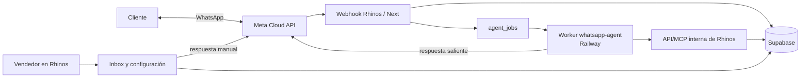

# Asistente comercial por WhatsApp

> Guía de arquitectura y backlog para el agregado de ventas conversacionales de Rhinos. Define el MVP de tesis y funciona como referencia de implementación.

## Objetivo y límites

Permitir que un cliente de cada organización consulte productos, precios y disponibilidad por WhatsApp, arme un pedido conversacional y genere una **preventa supervisada**. El equipo comercial conserva el control: puede tomar una conversación, responder desde Rhinos y confirmar la venta mediante los flujos existentes.

El asistente responde en español rioplatense con un tono natural y útil. No debe inventar precios, stock, políticas ni acciones. Si el cliente pregunta directamente, se identifica correctamente como asistente; no afirma ser una persona.

El MVP incluye consultas comerciales, carrito, cotización, preventa y derivación a una persona. No confirma ventas, no factura, no procesa pagos, anticipos ni descuenta stock. El panel de operación vive dentro de Rhinos; no habrá otro frontend.

## Decisiones de arquitectura

| Decisión | Definición |
| --- | --- |
| Repositorio | Un único repositorio: este. Los servicios se despliegan de manera independiente. |
| Canal | Meta Cloud API. Cada `phone_number_id` corresponde a una organización activa. |
| Rhinos | Next desplegado en Vercel: panel, APIs internas y webhook. |
| Worker | `services/whatsapp-agent`, servicio Node persistente desplegado en Railway. |
| Datos | El proyecto Supabase actual es la fuente de verdad comercial y conversacional. |
| Aislamiento | El número receptor resuelve la organización; el modelo nunca elige ni recibe un `organization_id` arbitrario. |
| Operaciones | El agente usa herramientas comerciales de Rhinos; no tiene SQL libre ni acceso administrativo general a Supabase. |

## Componentes y flujos

### Rhinos / Next

Incorporar `src/modules/whatsapp` y rutas bajo `/org/[orgSlug]/whatsapp`.

- **Configuración:** número, estado del bot, lista de precios, vendedor responsable, horario, reglas comerciales y derivación.
- **Inbox:** conversaciones, historial, carrito, preventa vinculada, asignación y respuesta manual.
- **Métricas:** desempeño del canal y asistente por organización.
- **Webhook Meta:** verifica la suscripción y persiste mensajes entrantes; nunca espera al modelo.
- **API/MCP interna:** ofrece únicamente operaciones comerciales autorizadas al agente.

El webhook verifica la firma, deduplica, persiste el mensaje, encola un trabajo durable y responde `200`. Si no existe una integración activa para el número, no encola automatización.

### Worker `services/whatsapp-agent`

El worker reclama trabajos pendientes, obtiene el contexto autorizado y opera el asistente:

1. Reclama un trabajo de forma exclusiva.
2. Lee conversación, últimos mensajes, carrito y configuración permitida.
3. Ejecuta el modelo y sus herramientas comerciales.
4. Registra la ejecución y cada llamada de herramienta.
5. Envía la respuesta por Meta o deriva a atención manual.
6. Termina el trabajo o programa un reintento transitorio.

No procesa conversaciones en atención manual, pausadas ni asociadas a una integración inactiva.

### Flujo de preventa

1. Identificar al cliente o solicitar el dato faltante.
2. Buscar productos y recuperar precio/disponibilidad desde Rhinos.
3. Actualizar el carrito y enviar un resumen con ítems, cantidades y total.
4. Requerir confirmación explícita del cliente.
5. Recalcular el carrito en Rhinos y crear una preventa vinculada a la conversación.
6. Informar la referencia y dejar el seguimiento al equipo comercial.

### Derivación humana

Se deriva si el cliente lo pide, la consulta queda fuera de las herramientas disponibles, una regla comercial no permite avanzar o falla una operación relevante. La derivación pausa el bot, registra motivo, crea una alerta y deja el caso listo para que un vendedor responda desde Rhinos. Sólo un usuario puede reactivar el bot de forma explícita.

## API/MCP interna

La autenticación representa una integración de sistema. Toda operación valida el contexto de organización que ya resolvió el webhook; nunca acepta alcance organizacional desde texto o parámetros controlados por el modelo.

| Herramienta | Resultado permitido |
| --- | --- |
| `find_customer_by_phone` | Buscar o reconocer al cliente de la organización. |
| `search_catalog` | Buscar productos comercializables por nombre, SKU o categoría. |
| `get_offer` | Consultar precio, lista aplicable y disponibilidad. |
| `get_cart` / `upsert_cart_item` | Leer y actualizar el carrito persistente. |
| `quote_cart` | Recalcular los totales con reglas comerciales vigentes. |
| `create_pre_sale` | Crear una preventa sólo después de confirmación explícita. |
| `get_pre_sale_status` | Consultar la preventa originada por la conversación. |
| `handoff_to_human` | Pausar el bot y alertar al equipo humano. |

La creación de preventa reutiliza la lógica de ventas de Rhinos. Debe registrar un actor de integración y guardar `source = 'WHATSAPP'` y `conversation_id`; no puede duplicar ni eludir cálculos de impuestos, listas de precios o validaciones existentes.

## Modelo de datos

Las nuevas tablas pertenecen al esquema `public`, se relacionan con `organizations` y aplican RLS basada en membresía. Las credenciales no se exponen al navegador.

| Tabla | Responsabilidad |
| --- | --- |
| `whatsapp_integrations` | Organización, `phone_number_id` único, estado, configuración comercial, referencia a secretos y vendedor responsable. |
| `whatsapp_conversations` | Conversación por integración y teléfono cliente; estado, asignación humana, cliente y preventa actual. |
| `whatsapp_messages` | Mensajes entrantes/salientes, ID externo único, contenido, dirección, estado de entrega y fecha. |
| `conversation_carts` | Carrito persistente, precios/cantidades y estado de confirmación. |
| `agent_jobs` | Cola durable: mensaje origen, estado, intentos, próximo intento, bloqueo y error. |
| `agent_runs` | Auditoría: ejecución, latencia, costo, resultado, herramientas y error. |

Cambios en `sales_orders`:

- Agregar origen WhatsApp para preventas.
- Agregar `conversation_id` opcional, referenciando a la conversación origen.
- Conservar el estado de preventa actual de Rhinos: el agente no crea una venta confirmada.

Restricciones e índices mínimos:

- `whatsapp_integrations.phone_number_id` único.
- `whatsapp_messages.external_message_id` único para idempotencia.
- Una conversación lógica por integración y teléfono normalizado.
- Índices por `organization_id`, estado conversacional y trabajos pendientes.
- Reclamo exclusivo de un `agent_job` por worker.

## Panel dentro de Rhinos

| Ruta | Contenido |
| --- | --- |
| `/org/[orgSlug]/whatsapp/conversaciones` | Inbox, filtros, historial, carrito, preventa y respuesta manual. |
| `/org/[orgSlug]/whatsapp/metricas` | Conversaciones, respuesta, preventas, conversión, abandono, derivaciones, intervención humana, productos y faltantes. |
| `/org/[orgSlug]/whatsapp/configuracion` | Meta, lista de precios, vendedor, horario, activación y reglas de derivación. |

Los permisos del módulo distinguen lectura de inbox, atención de conversaciones, administración de configuración y lectura de métricas.

## Backlog

### Fase 1 — Fundación

- Crear migraciones para tablas conversacionales, origen WhatsApp y vínculo a preventa.
- Definir tipos, schemas Zod, permisos, RLS y política de secretos.
- Implementar la configuración de integración y el mapeo seguro de número a organización.

**Salida:** una organización configura una integración activa sin que otra pueda verla o usarla.

### Fase 2 — Canal y trazabilidad

- Implementar verificación y recepción del webhook de Meta Cloud API.
- Persistir mensajes de forma idempotente y crear trabajos durables.
- Crear el worker Railway con reclamación, reintentos y registro de errores.
- Implementar mensajes salientes y estado de entrega.

**Salida:** cada mensaje queda trazado y se procesa una sola vez aunque Meta lo reintente.

### Fase 3 — Asistente comercial

- Implementar API/MCP y herramientas comerciales acotadas.
- Integrar cliente, catálogo, precio, disponibilidad y carrito.
- Incorporar resumen, confirmación explícita y creación auditable de preventa.
- Registrar ejecuciones, llamadas de herramienta, latencia y costo.

**Salida:** el bot llega a una preventa sin confirmar ventas ni descontar stock.

### Fase 4 — Operación humana

- Crear inbox, alertas, asignación y respuesta manual dentro de Rhinos.
- Pausar y reactivar automatización con estados claros.
- Vincular conversación con cliente, carrito y preventa.

**Salida:** un vendedor puede continuar cualquier caso no resuelto por el bot.

### Fase 5 — Métricas y tesis

- Construir dashboard por organización y período.
- Medir respuesta, preventas, conversión, abandono y derivación.
- Documentar el protocolo de comparación entre proceso manual y asistido.

**Salida:** evidencia cuantitativa para evaluar el impacto operativo del asistente.

### Evoluciones fuera del MVP

- Confirmación autónoma de ventas.
- Pagos, anticipos y medios de pago.
- Seguimiento proactivo, campañas y plantillas de WhatsApp.
- Más canales y uso del agente por otros sistemas.

## Seguridad y operación

- Validar las firmas de Meta y no registrar secretos ni datos sensibles en logs.
- Cifrar o referenciar externamente tokens de WhatsApp; nunca enviarlos al frontend.
- Aplicar límites de tasa por integración/conversación y límite de contexto.
- Usar transacciones o RPCs para actualizaciones de carrito y preventa.
- Registrar actor, integración, conversación y organización en toda operación comercial iniciada por el agente.
- Reintentar sólo errores transitorios; los casos agotados quedan visibles para una persona.

## Criterios de aceptación y pruebas

- Un número de WhatsApp no puede leer, cotizar ni crear datos de otra organización.
- Eventos repetidos de Meta no duplican mensajes, carritos ni preventas.
- El webhook responde tras persistir/encolar, sin esperar al modelo.
- El agente crea una preventa sólo después de confirmación explícita y recalcular desde Rhinos.
- Una conversación derivada pausa al bot, alerta al equipo y admite respuesta manual desde Rhinos.
- Las pruebas cubren productos ambiguos, clientes inexistentes, precio/stock no disponible, integración inactiva, fallas de Meta/LLM, reintentos y accesos entre organizaciones.

## Indicadores para la tesis

Comparar flujo manual y asistido por período, organización y canal:

- Tiempo hasta la primera respuesta y hasta crear una preventa.
- Conversaciones que terminan en preventa y preventas que terminan en venta confirmada por el equipo.
- Tasa de abandono, derivación e intervención manual.
- Productos más consultados y consultas sin disponibilidad.
- Costo medio de procesamiento por conversación.

La evaluación debe diferenciar automatización total de asistencia supervisada: el objetivo del MVP es reducir carga operativa sin eliminar la revisión comercial humana.
